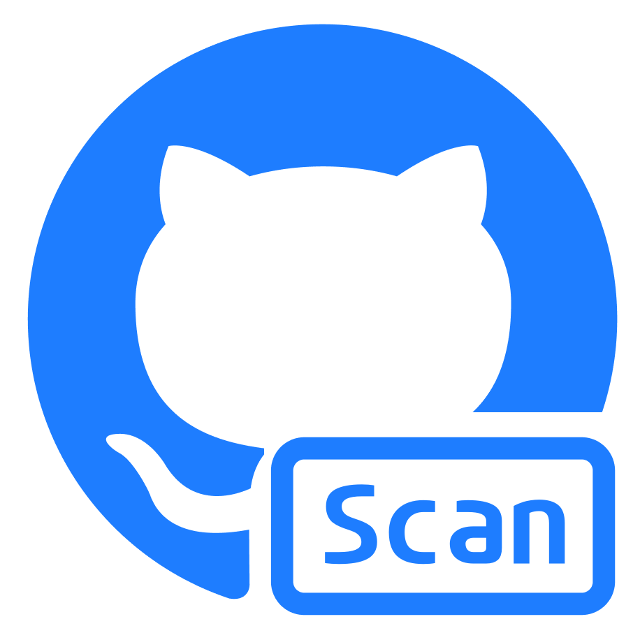

# CodeQL Scanner VSCode Extension



[](https://marketplace.visualstudio.com/items?itemName=codeql-scanner.codeql-scanner-vscode)
[](https://marketplace.visualstudio.com/items?itemName=codeql-scanner.codeql-scanner-vscode)
[](LICENSE)

## 🔍 Supercharge Your Code Security with CodeQL

Seamlessly integrate GitHub's powerful CodeQL scanning engine directly into your VS Code workflow. Detect vulnerabilities, find security flaws, and improve code quality without leaving your editor.

## ✨ Key Features

- **🛡️ Instant Security Analysis**: Scan your code for vulnerabilities directly from VSCode
- **🔄 Real-Time Feedback**: Get immediate security insights as you code
- **📊 Rich Result Visualization**: View detailed vulnerability reports with syntax highlighting and data flow paths
- **🌊 Data Flow Analysis**: Trace security issues from source to sink with intuitive navigation
- **🔄 GitHub Integration**: Connect to GitHub for enhanced scanning capabilities and team collaboration
- **⚙️ Flexible Configuration**: Choose between local and remote scanning options to suit your workflow
- **🧰 Multi-Language Support**: Analyze JavaScript, TypeScript, Python, Java, C#, C/C++, Go, Ruby, Swift, Kotlin, and Scala code

## 🚀 Getting Started

1. Install the extension from the [VS Code Marketplace](https://marketplace.visualstudio.com/items?itemName=codeql-scanner.codeql-scanner-vscode)
2. Configure your GitHub token (optional for enhanced features)
3. Open any code repository
4. Run a scan using the command palette (`Ctrl+Shift+P` or `Cmd+Shift+P`): `CodeQL: Run Scan`

## 📋 Available Commands

| Command | Description |
|---------|-------------|
| `CodeQL: Run Scan` | Start a security scan on the current workspace |
| `CodeQL: Initialize Repository` | Set up CodeQL for the current repository |
| `CodeQL: Run Analysis` | Execute a full code analysis |
| `CodeQL: Configure Settings` | Open the extension settings |
| `CodeQL: Show Logs` | View the extension's log output |
| `CodeQL: Clear Logs` | Clear all log entries |
| `CodeQL: Clear Inline Diagnostics` | Remove inline problem markers |
| `CodeQL: Show CLI Information` | Display information about the CodeQL CLI |
| `CodeQL: Copy Flow Path` | Copy vulnerability data flow path to clipboard |
| `CodeQL: Navigate Flow Steps` | Step through vulnerability data flow paths |

## ⚙️ Configuration Options

The extension provides several configuration options to customize its behavior:

```json
{
  "codeql-scanner.github.token": "your-github-token",
}
```

## 💡 Why CodeQL Scanner?

CodeQL is GitHub's semantic code analysis engine that lets you query code as if it were data. This extension brings that power directly into VS Code, allowing you to:

- Detect potential security vulnerabilities early in development
- Understand complex security issues with clear data flow visualization
- Integrate advanced security scanning into your daily coding workflow
- Improve code quality with actionable insights

## 🔗 Integration with GitHub

Connect the extension to GitHub for enhanced capabilities:
- Access GitHub's vast CodeQL query library
- Synchronize with your GitHub repositories
- View and manage GitHub code scanning alerts

## 🛠️ Development

Want to contribute? Great! You can:

1. Clone the repository: `git clone https://github.com/geekmasher/codeql-scanner-vscode.git`
2. Install dependencies: `npm install`
3. Build the extension: `npm run compile`
4. Run tests: `npm run test`

## 📜 License

This project is licensed under the terms specified in the [LICENSE](LICENSE) file.

## 🙏 Acknowledgements

- Built on GitHub's powerful [CodeQL](https://github.com/github/codeql) engine
- Inspired by the need for accessible security tools for all developers

---

Happy Secure Coding! 🔒✨
